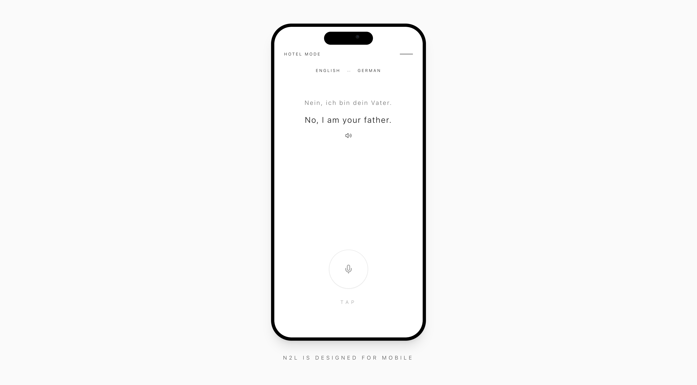
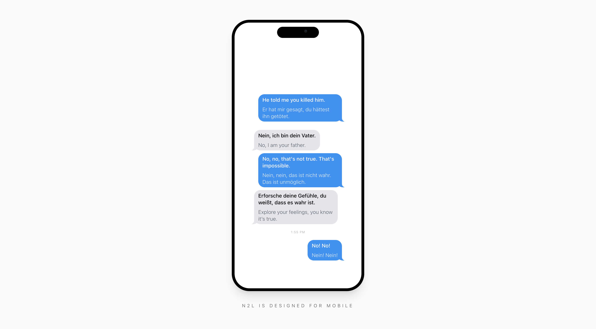

# (kinda) Real-Time AI Voice Translator 




[](https://nextjs.org/)
[](https://www.typescriptlang.org/)

Groq for STT & language detection, ElevenLabs for TTS and DeepSeek for translation.

## Quick Start
1. Install dependencies
```bash
npm install
```

2. Set environment variables (.env)
```env
GROQ_API_KEY=your_groq_key
DEEPSEEK_API_KEY=your_deepseek_key
ELEVENLABS_API_KEY=your_elevenlabs_key
```

3. Start development server
```bash
npm run dev
```
